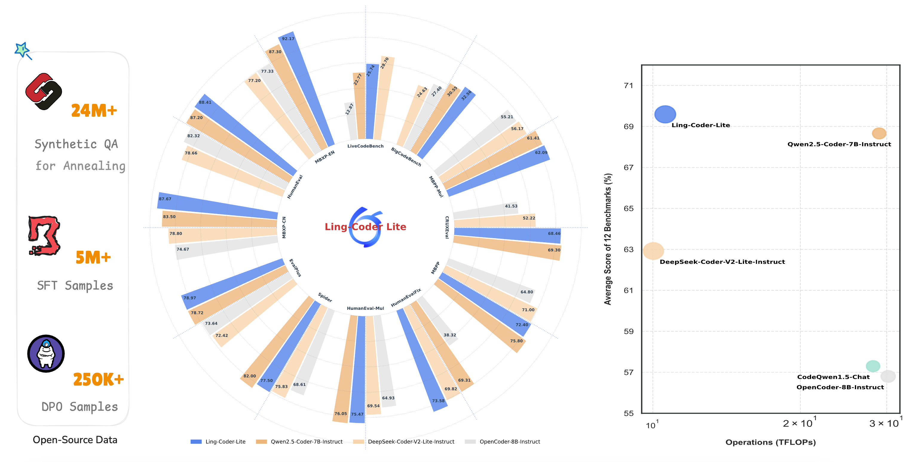

# Ling-Coder-Lite

<p align="center">
    
<p>

<p align="center">
          🤗 <a href="https://huggingface.co/inclusionAI">Hugging Face</a>&nbsp&nbsp | &nbsp&nbsp🤖 <a href="https://modelscope.cn/organization/inclusionAI">ModelScope</a>&nbsp&nbsp | &nbsp&nbsp🖥️ <a href="https://github.com/codefuse-ai/Ling-Coder-Lite">GitHub</a>

## Introduction

Ling-Coder-Lite is a MoE LLM provided and open-sourced by InclusionAI, which has 16.8B parameters with 2.75B activated parameters. This model demonstrates state-of-the-art performance on 12 coding benchmarks, while simultaneously offering competitive latency and throughput compared to code LLMs of similar size. In addition to open-sourcing the model itself, we also release a substantial amount of code-related data, including synthetic QA, SFT and DPO datasets.

<p align="center">
    
<p>

## Model Downloads

You can download the following table to see the various parameters for your use case. If you are located in mainland China, we also provide the model on ModelScope.cn to speed up the download process.

<div align="center">

|   **Model**    | **#Total Params** | **#Activated Params** | **Context Length** |                                                                     **Download**                                                                     |
| :------------: | :---------------: | :-------------------: | :----------------: | :--------------------------------------------------------------------------------------------------------------------------------------------------: |
| Ling-Coder-lite-base |       16.8B        |         2.75B         |        16K         | [🤗 HuggingFace](https://huggingface.co/inclusionAI/Ling-Coder-lite-base) <br>[🤖 ModelScope](https://modelscope.cn/models/inclusionAI/Ling-Coder-lite-base) |
|   Ling-Coder-lite    |       16.8B        |         2.75B         |        16K         |      [🤗 HuggingFace](https://huggingface.co/inclusionAI/Ling-Coder-lite) <br>[🤖 ModelScope](https://modelscope.cn/models/inclusionAI/Ling-Coder-lite)      |

</div>

## Dataset Downloads

<div align="center">

|   **Model**    | **Samples** |                                                                     **Download**                                                                     |
| :------------: | :----------------: | :--------------------------------------------------------------------------------------------------------------------------------------------------: |
| Ling-Coder-SyntheticQA |        24M         | [🤗 HuggingFace](https://huggingface.co/datasets/inclusionAI/Ling-Coder-SyntheticQA) <br>[🤖 ModelScope](https://modelscope.cn/datasets/inclusionAI/Ling-Coder-SyntheticQA) |
| Ling-Coder-SFT  |        5M         |      [🤗 HuggingFace](https://huggingface.co/datasets/inclusionAI/Ling-Coder-SFT) <br>[🤖 ModelScope](https://modelscope.cn/datasets/inclusionAI/Ling-Coder-SFT)      |
| Ling-Coder-DPO  |        250K         | [🤗 HuggingFace](https://huggingface.co/datasets/inclusionAI/Ling-Coder-DPO) <br>[🤖 ModelScope](https://modelscope.cn/datasets/inclusionAI/Ling-Coder-DPO) |

</div>

## Evaluation

Detailed evaluation results are reported in our [technical report](https://arxiv.org/abs/2503.17793).

## Quickstart

### 🤗 Hugging Face Transformers

Here is a code snippet to show you how to use the chat model with `transformers`:

```python
from transformers import AutoModelForCausalLM, AutoTokenizer

model_name = "inclusionAI/Ling-Coder-lite"

model = AutoModelForCausalLM.from_pretrained(
    model_name,
    torch_dtype="auto",
    device_map="auto",
    trust_remote_code=True
)
tokenizer = AutoTokenizer.from_pretrained(
    model_name, 
    trust_remote_code=True
)

prompt = "Write a quick sort algorithm in python."
messages = [
    {"role": "user", "content": prompt}
]
text = tokenizer.apply_chat_template(
    messages,
    tokenize=False,
    add_generation_prompt=True
)
model_inputs = tokenizer([text], return_tensors="pt").to(model.device)

generated_ids = model.generate(
    **model_inputs,
    max_new_tokens=512
)
generated_ids = [
    output_ids[len(input_ids):] for input_ids, output_ids in zip(model_inputs.input_ids, generated_ids)
]

response = tokenizer.batch_decode(generated_ids, skip_special_tokens=True)[0]
print(response)
```

### 🤖 ModelScope

If you're in mainland China, we strongly recommend you to use our model from 🤖 <a href="https://modelscope.cn/organization/inclusionAI">ModelScope</a>.

## Deployment

### vLLM

vLLM supports offline batched inference or launching an OpenAI-Compatible API Service for online inference.

#### Environment Preparation

Since the Pull Request (PR) has not been submitted to the vLLM community at this stage, please prepare the environment by following the steps below:

```bash
git clone -b  v0.7.3 https://github.com/vllm-project/vllm.git
cd vllm
git apply Ling-Coder-Lite/inference/vllm/bailing_moe.patch
pip install -e .
```

#### Offline Inference:

```bash
from transformers import AutoTokenizer
from vllm import LLM, SamplingParams

tokenizer = AutoTokenizer.from_pretrained("inclusionAI/Ling-Coder-lite")

sampling_params = SamplingParams(temperature=0.7, top_p=0.8, repetition_penalty=1.05, max_tokens=512)

llm = LLM(model="inclusionAI/Ling-Coder-lite", dtype='bfloat16')
prompt = "Give me a short introduction to large language models."
messages = [
    {"role": "system", "content": "You are Ling-Coder-Lite, an assistant created by CodeFuse-AI"},
    {"role": "user", "content": prompt}
]

text = tokenizer.apply_chat_template(
    messages,
    tokenize=False,
    add_generation_prompt=True
)
outputs = llm.generate([text], sampling_params)


```

#### Online Inference:

```bash
vllm serve inclusionAI/Ling-lite \
              --tensor-parallel-size 2 \
              --pipeline-parrallel-size 1 \
              --use-v2-block-manager \
              --gpu-memory-utilization 0.90
```

For detailed guidance, please refer to the vLLM [`instructions`](https://docs.vllm.ai/en/latest/).

## Finetuning

We recommend you to use [Llama-Factory](https://github.com/hiyouga/LLaMA-Factory) to finetune Ling with SFT, DPO, etc.

We use [`identity`](https://github.com/hiyouga/LLaMA-Factory/blob/main/data/identity.json) to demonstrate how to finetune our Ling models by replacing `name` with `Ling` and `author` with `inclusionAI`.

```json
{
  "instruction": "hi",
  "input": "",
  "output": "Hello! I am Ling-Coder-Lite, an AI assistant developed by CodeFuse-AI. How can I assist you today?"
}
```

We provide a demo configuration of `Llama-Factory` to SFT Ling models as follows:

```bash
llamafactory-cli train examples/sft/ling_full_sft.yaml
```

## License

This code repository is licensed under [the MIT License](https://github.com/codefuse-ai/Ling-Coder-Lite/blob/master/LICENCE).

## Citation
If you find our work is useful or helpful, please feel free to cite our paper as below.

```
@misc{codefuse2025samplemattersleveragingmixtureofexperts,
      title={Every Sample Matters: Leveraging Mixture-of-Experts and High-Quality Data for Efficient and Accurate Code LLM}, 
      author={Codefuse and Ling Team},
      year={2025},
      eprint={2503.17793},
      archivePrefix={arXiv},
      primaryClass={cs.LG},
      url={https://arxiv.org/abs/2503.17793}, 
}
```
